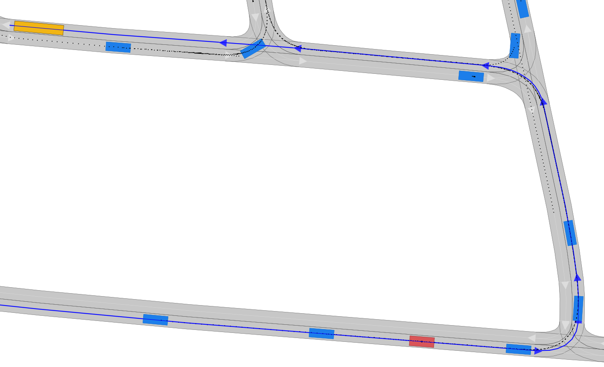
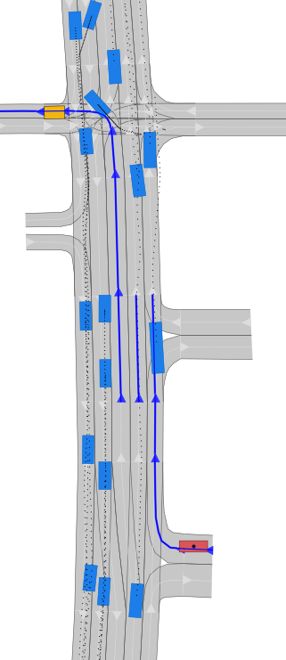

# CommonRoad-Route-Planner

 

This repository hosts the code base of a commonly used route planner.
It plans a route on the lanelets going in the same direction.
It also works on scenarios, where no goal region is specified.

## Installation

To use this module, run the setup script in the root folder:

```bash
python setup.py install
```

## Usage

You can find an example under `example/example_usage.py`:
```python
from commonroad_route_planner.util import plot_found_routes
from commonroad.common.file_reader import CommonRoadFileReader
from commonroad_route_planner.route_planner import RoutePlanner


if __name__ == "__main__":
    scenario_path = 'example_scenarios/USA_Peach-2_1_T-1.xml'

    print(f"Loading scenario {scenario_path}")

    # open and read in scenario and planning problem set
    scenario, planning_problem_set = CommonRoadFileReader(scenario_path).open()

    print(f"Scenario {scenario_path} loaded!")

    # retrieve planning problem with given index (for cooperative scenario:0, 1, 2, ..., otherwise: 0)
    # with the heuristic A* we do not want to solve cooperative scenarios so in all cases we will have
    # only one planning problem
    planning_problem_idx = 0
    planning_problem = list(planning_problem_set.planning_problem_dict.values())[planning_problem_idx]

    route_planner = RoutePlanner(scenario, planning_problem, backend="networkx")
    routes = route_planner.search_alg()

    plot_found_routes(scenario, planning_problem, routes)
```

It should give the following result.



### Backends
The route planner supports different backends to search the shortest path
* networkx
* priority queue with graph based A*

After som experiments, the second one is a slightly faster but needs further analysis.


## Future plans

Possible improvements:
* use redefine the cost of a lanelet using time approach (eg.: time_cost = lanelet_length / max_velocity)
